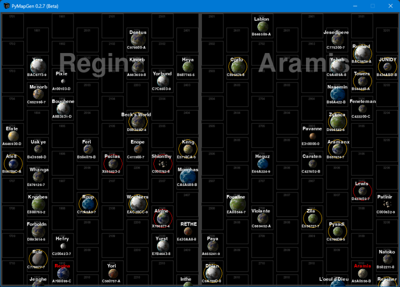

**PyMapGen 0.0.8b for Python 3.9**
==================================

**PyMapGen** is a Python 3.9 program for viewing Traveller RPG stellar maps. Of course, it's a much smaller project than what's going on over at https://github.com/inexorabletash/travellermap

The Traveller game in all forms is owned by Far Future Enterprises.
Copyright 1977 - 2022 Far Future Enterprises.
Traveller is a registered trademark of Far Future Enterprises.

.. image:: images/video.png
    :target: https://www.youtube.com/watch?v=9HZSrX36lh8

.. figure:: images/mapgen_screen1.png

.. figure:: images/mapgen_screen3.png

.. figure:: images/mapgen_screen4.png

Requirements
------------

* **Windows 10**

   Not functional in OSX or Linux.

* **pyttsx3 2.90**

   PyMapGen speaks in Zira's voice (her voice comes with Windows). Can be changed to a different voice in the source.

* **colorama 0.4.4**

   Because CMD may have some colored text messages for debugging.
   
* **pygame 2.1.0**

   PyGame is used to draw the maps. It's basically a Python wrapper for SDL 2.0.16, which PyGame includes.

Warning
-------

**PyMapGen** will not work with **Python 2.7-**.

Usage
-----

Click on a sector to center it.

Dragging a sector (or pressing the arrow keys) will scroll the map.

The ``mouse wheel`` will zoom the map in and out while pointing.

Pressing ``m`` will toggle the computer's voice on/off.

Pressing ``h`` will flip to a hex map(s) at different zoom levels.

Pressing ``r`` will flip to a rectangle map.

Pressing ``c`` will toggle solid/clear travel zones while zoomed in.

Pressing ``z`` will toggle circle/hex/rectangle travel zones while zoomed in.

Pressing ``t`` will toggle world UWP/TC while zoomed in.

Pressing ``l`` will toggle the world system locations on/off.

Pressing ``g`` will toggle the hex/rectangle grid on/off.

Pressing ``ESC`` will exit the program.

.. |ss| raw:: html

    <strike>

.. |se| raw:: html

    </strike>

Things To-Do
------------

| Add subsector names.
| Add trade routes.
| Instruction manual.
| Cheat codes.
|ss|

| Port over to Python 3.9 from 2.5.
| Start on a To-Do.

|se|

**Known History**

* v0.0.8b

  Fixed the blue Allegiances.
  
  Removed 3rd-party voices.

Contact
-------
Questions? Please contact shawndriscoll@hotmail.com
